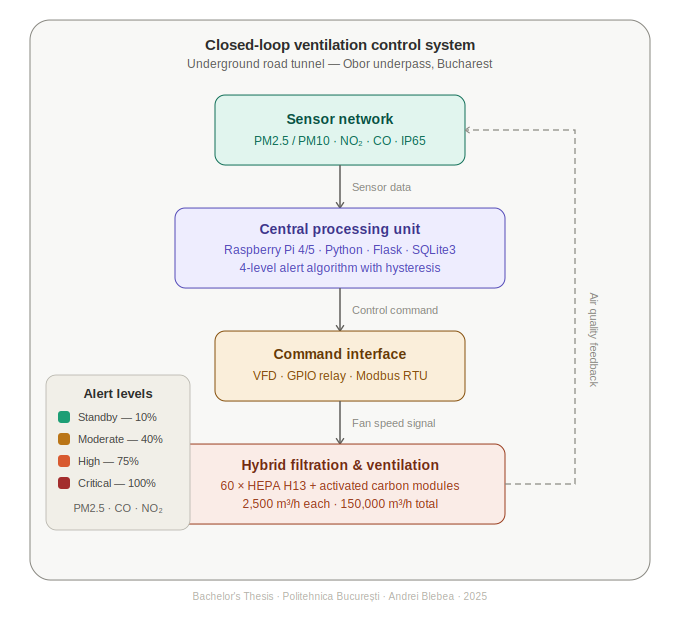
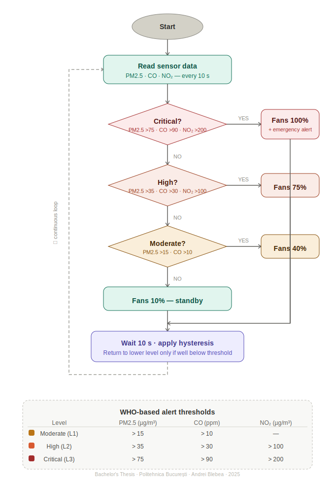
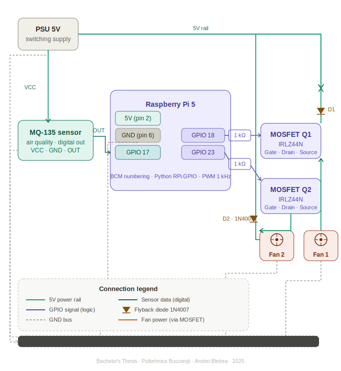

# Tunnel Management System – Ventilation Control

**Bachelor's Thesis · Politehnica București · Faculty of Transportation · 2025**

> *Designing an intelligent hybrid air filtration and control system for underground road tunnels, with a case study on Bucharest's Obor underpass.*

---

## About the Project

Underground road tunnels concentrate vehicle exhaust emissions in enclosed spaces, creating serious air quality and public health risks that current Romanian regulations largely fail to address. This thesis proposes a complete engineering solution for modernizing tunnel ventilation systems through the integration of hybrid air filtration technology (HEPA + activated carbon) and an intelligent real-time control system based on low-cost embedded hardware.

The work covers the full engineering cycle: from a comparative analysis of existing technologies and international case studies, through system architecture design and component selection, to a functional prototype demonstration and a detailed techno-economic feasibility study.

---

## Problem Statement

Fine particulate matter (PM2.5, PM10), nitrogen oxides (NOx), and carbon monoxide (CO) accumulate in road tunnels at concentrations far exceeding safe thresholds. While cities like Hong Kong, Madrid, and Sydney have already deployed advanced tunnel air treatment systems — achieving up to 80% pollutant reduction — Romanian technical standards contain no specific requirements for air filtration in road underpasses.

This gap represents both a public health risk and a regulatory opportunity that this project aims to address.

---

## Proposed Solution

A four-component closed-loop control system that continuously monitors air quality and dynamically adjusts ventilation output:



```
Sensor Network (PM, NOx, CO)
        │
        ▼
Central Processing Unit (Raspberry Pi)
        │
        ▼
Command Interface (VFD / Relay Board)
        │
        ▼
Hybrid Filtration & Ventilation System (HEPA H13 + Activated Carbon)
        │
        └──── feedback ────────────────────────────►
```

**Control Algorithm — 4 Alert Levels:**

| Level    | Condition            | Fan Speed |
|----------|----------------------|-----------|
| Standby  | Below all thresholds | 10%       |
| Moderate | Level 1 threshold    | 40%       |
| High     | Level 2 threshold    | 75%       |
| Critical | Level 3 threshold    | 100% + alert |


---

## System Architecture

### Hardware Stack



| Component | Details |
|-----------|---------|
| Central Processing Unit | Raspberry Pi 4 / 5 (industrial enclosure, stabilized PSU, high-endurance SD) |
| Particulate Sensors | PM2.5 / PM10 — laser scattering principle |
| Gas Sensors | NO₂, CO — industrial electrochemical, IP65 rated |
| Actuators | Evacuation fans via VFD (Variable Frequency Drive) |
| Command Interface | Industrial relay board (GPIO) + Modbus RTU via USB-RS485 |
| Filtration Modules | 60× hybrid HEPA H13 + activated carbon units (2,500 m³/h each) |

### Software Stack

| Layer | Technology |
|-------|-----------|
| OS | Raspberry Pi OS (Debian Linux) |
| Language | Python |
| GPIO / Relay control | `RPi.GPIO` / `gpiozero` |
| Serial / Modbus | `pyserial` / `minimalmodbus` |
| Web monitoring interface | Flask / Django |
| Local data storage | SQLite3 |

---

## Case Study — Obor Underpass, Bucharest

The Obor underpass was selected as the pilot site based on a multi-criteria analysis (traffic volume, proximity to residential areas and schools, geometric parameters, and maintenance accessibility).

| Parameter | Value |
|-----------|-------|
| Length | ~485 m |
| Width | ~16 m |
| Height | ~5 m |
| Total air volume | ~38,800 m³ |
| Daily traffic | ~45,000 vehicles/day |
| Heavy/diesel vehicle share | ~35% |
| Existing jet fans | 12 (total flow ~150,000 m³/h) |
| Required filtration modules | 60 hybrid units |

---

## Techno-Economic Analysis

### CAPEX Estimate (filtration components only)

| Item | Unit Cost | Qty | Total |
|------|-----------|-----|-------|
| Hybrid HEPA + Carbon module | 500–700 € | 60 | ~30,000–42,000 € |
| Raspberry Pi + sensors + wiring | — | 1 set | ~800–1,200 € |
| Installation & system integration | — | — | ~5,000–7,000 € |

### Filter Comparison

| Filter Type | Capacity | Unit Cost | Lifespan |
|-------------|----------|-----------|----------|
| HEPA (H13–H14) | 2,000–3,000 m³/h | 250–400 € | 6–12 months |
| Activated Carbon | 1,500–2,500 m³/h | 300–450 € | 3–6 months |
| Electrostatic | 4,000–8,000 m³/h | 1,500–2,500 € | 1–2 years |
| **Hybrid HEPA + Carbon** | **2,000–2,500 m³/h** | **500–700 €** | **6–9 months** |

### Key Figures

- Estimated energy consumption: **15–25 kWh/h** (full operation)
- Pressure drop per HEPA unit: **250–350 Pa**
- Estimated PM reduction: **~80%**
- Estimated NOx reduction: **~55%**
- EU Green Deal funding eligibility: **Yes**

---

## Thesis Structure

| Chapter | Title |
|---------|-------|
| 1 | Introduction — motivation, context, objectives, methodology |
| 2 | Justification & Comparative Analysis — historical context, existing technologies, SWOT, international models |
| 3 | Technical Solution Design — system architecture, hardware/software configuration, Obor case study, hybrid filter sizing |
| 4 | Prototype Implementation & Testing — component selection, assembly, electrical schematic, test results |
| 5 | Techno-Economic & Reliability Analysis — CAPEX, OPEX, ROI, maintenance plan, MTBF calculation |
| 6 | Future Development Directions — metropolitan scaling, IoT integration, modular design, national standard proposal |

---

## SWOT Summary

| Strengths | Weaknesses |
|-----------|------------|
| Dual pollutant removal (particles + gases) | Filter replacement frequency |
| Integrates with existing infrastructure | High-pressure drops require powerful fans |
| High energy efficiency via intelligent control | Limited official data for Romanian tunnels |
| Relatively low implementation cost | |

| Opportunities | Threats |
|---------------|---------|
| EU Green Deal funding eligibility | Administrative inertia |
| Basis for national technical standard | Long-term consumable cost variability |
| Real-time air quality data generation | Public perception of cost vs. benefit |
| Scalable to other enclosed infrastructures | |

---

## Academic Information

| | |
|-|-|
| **University** | National University of Science and Technology Politehnica București |
| **Faculty** | Faculty of Transportation |
| **Department** | Remote Control and Electronics in Transportation |
| **Thesis Type** | Bachelor's Degree Project (*Proiect de Diplomă*) |
| **Scientific Coordinator** | Assoc. Prof. Dr. Eng. Ec. Florin Codruț Nemțanu |
| **Author** | Andrei Blebea |
| **Year** | 2025 |

---

## License

This repository contains academic work submitted for a Bachelor's degree at Politehnica București. The content is shared for educational and portfolio purposes. If you wish to reference or build upon this work, please provide appropriate attribution.
